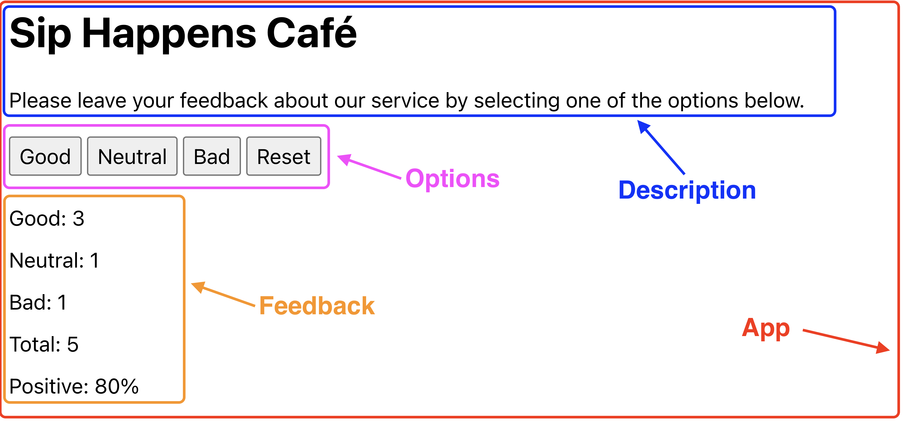

## Віджет відгуків

Напиши застосунок для збору відгуків про кав'ярню Sip Happens Café. Подивись [демо-відео](https://youtu.be/fPaqeL_J4Dk) роботи застосунку.

Застосунок повинен відображати кількість зібраних відгуків для кожної категорії: good, neutral, bad. Застосунок повинен зберігати статистику відгуків між оновленням сторінки.

### Компоненти
В цьому завданні інтерфейс вже розділений на компоненти, твоя задача перенести це в код. Частини інтерфейсу, що входять в компонент, обведені рамкою відповідного кольору.



Як бачиш, всі компоненти рендеряться всередині компонента App.

Назва кав'ярні
> Sip Happens Café

Текст опису
> Please leave your feedback about our service by selecting one of the options below.

## Крок 1
У компоненті App створи стан для зберігання типів відгуків. Нехай це буде об'єкт з одноіменними властивостями:

```javascript
{
	good: 0,
	neutral: 0,
	bad: 0
}
```

## Крок 2
Додай обробник стану, щоб при кліках по кнопках в компоненті Options змінювався стан компонента App.

Оголоси функцію updateFeedback(feedbackType), яка приймає один параметр - тип фідбеку, тобто ім'я властивості зі стану, рядки “good”, “bad” або “neutral”.

```javascript
const updateFeedback = (feedbackType) => {
  // Тут використовуй сеттер, щоб оновити стан
};
```

Передай функцію updateFeedback як пропс в компонент Options і викликай її при кліках по кнопках, передаючи тип фідбеку (рядки “good”, “bad” або “neutral”) як аргумент.

Після цього кроку при кліках по кнопках в компоненті Options буде оновлюватися інтерфейс.

## Крок 3
Зроби так, щоб компонент Feedback рендерився тільки після того, як було зібрано хоча б один відгук. Загальна кількість відгуків - це просто сума станів:

```javascript
const totalFeedback = good + neutral + bad;
```

Оскільки стан зберігається в компоненті App, то і обчислення totalFeedback буде правильно виконувати в цьому компоненті, і передавати вже обчислене значення пропсами іншим компонентам, а також використовувати в App для умовного рендерингу.

Повідомлення про відсутність статистики перенеси в компонент Notification і відобрази його в App. Для цього використовуй умовний рендеринг в компоненті App.

## Крок 4
Додай кнопку Reset для скидання зібраних відгуків у компонент Options. При кліку на неї стан, що відповідає за відгуки, повинен обнулитися. Кнопка Reset видима тільки в разі наявності хоча б одного відгуку, так само, як і компонент Feedback.

Для умовного рендерингу використовуй попередньо обчислене значення totalFeedback з компонента App і передавай його як пропс в Options.

## Крок 5
Розшир функціонал застосунку таким чином, щоб в інтерфейсі відображалося більше статистики про зібрані відгуки. Додай відображення загальної кількості зібраних відгуків з усіх категорій та відсоток позитивних відгуків. Це всі обчислювані значення, які не потрібно зберігати в стані. Передай ці значення через пропси в відповідні компоненти.

Загальна кількість відгуків - це просто сума станів:

```javascript
totalFeedback = good + neutral + bad;
```

Для підрахунку відсотка позитивних відгуків можна використовувати наступну формулу:

```javascript
Math.round((good / totalFeedback) \* 100)
```

Зверни увагу, що для значень totalFeedback і positiveFeedback не потрібно створювати окремі властивості в стані, оскільки це дані, що легко обчислюються на основі існуючого стану. Це не тільки оптимізує використання пам'яті та ресурсів, але й зменшує ризик виникнення помилок, пов'язаних із не синхронізованим станом даних.

Після цього кроку інтерфейс застосунку буде завершений.

## Крок 6
Зроби так, щоб статистика відгуків зберігалася між перезавантаженнями сторінки. Використовуй ефекти та локальне сховище для збереження стану при його зміні, а при завантаженні сторінки ініціалізуй стан і локальне сховище для зчитування збережених даних та запису їх у стан.

Якщо на момент завантаження додатка в локальному сховищі нічого не збережено, стан повинен ініціалізуватися нулями.

## Домашнє завдання
- Створен репозиторій goit-react-hw-02
- При здачі домашньої роботи є два посилання: на вихідні файли та робочу сторінку завдання на Vercel.
- Проект створено за допомогою Vite.
- Під час запуску коду завдання в консолі відсутні помилки та попередження.
- Для кожного компонента у папці src/components є окрема папка, яка містить JSX файл самого React компонента та файл його стилів. Назва папки, файла компонента (з розширенням .jsx) та файла стилів (перед .module.css) однакова і відповідає назвам, вказаним у завданнях (якщо вони були)
- Для експорту компонентів використовується експорт за замовчуванням (export default).
- JS-код чистий і зрозумілий, використовується Prettier.
- Стилізація виконана CSS-модулями
